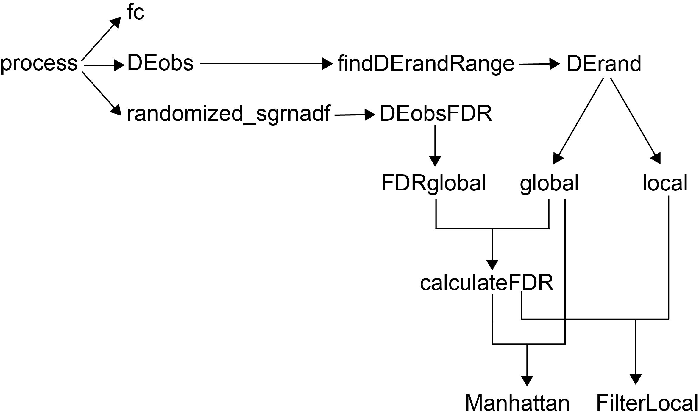

# nf-pySpade
The Nextflow pipeline for pySpade. 
Details about pySpade: https://github.com/Hon-lab/pySpade

## Introduction 


To run the pySpade pipeline, please prepare the folloing input files:
1. Mapped transcriptome matrix: provide the Cell Ranger path that contains "filtered_feature_bc_matrix.h5".
2. Mapped sgRNA matrix: the column is cell ID, and the index is sgRNA name. The sgRNA matrix should represent if the sgRNA is present in the cell. More than 1 is considered presented, 0 is not presented.
3. sgRNA dictionary: the reference file of perturbation regions and the targeting sgRNA. Example of first line (separated by tab):
   chr1:1234567-1235067 sg1;sg2;sg3;sg4;sg5
4. positive control file: the file is used in the `fc` function in order to see if positive controls have good repression/activation. Example of first line (separated by tab):
   chr1:1234567-1235067  ACTB

The defalult parameters show here, please change them if needed. 
1. output directory: current folder
2. FDR (false discovery rate): 0.1. 10% of false discovery rate.
3. fold change cutoff: 0.2. Fold change need to be more than 20% (up-regulation and down-regulation) to be considered as hit.
4. expression level cutoff: 0.05. Genes need to be expressed in more than 5% of cells to be considered as hit.

## Running the Pipeline

### Basic execution
```bash
sbatch log.run_nextflow.sh
```

### With resume after crash
The pipeline automatically resumes from the last successful step:
```bash
nextflow run main.nf -resume
```

## Optimizations (v0.2)

This pipeline includes several optimizations for performance and reliability:

1. **GPU Acceleration**: DEobs and DErand processes can utilize GPU resources for faster hypergeometric tests
2. **Crash Recovery**: Automatic resume capability to continue from interruption point
3. **Execution Reports**: Detailed metrics on time and compute resources for each step
4. **Container Updates**: Uses latest pySpade container (0.1.7) from Docker Hub

For detailed information, see:
- [OPTIMIZATION_NOTES.md](OPTIMIZATION_NOTES.md) - Usage and configuration guide
- [GPU_IMPLEMENTATION_NOTES.md](GPU_IMPLEMENTATION_NOTES.md) - GPU setup and troubleshooting

## Output 
1. Manhattan_plots/filtered_df.csv: the global hits (trans regulated genes) after FDR, fold change and expression level filtering.
2. Manhattan_plots/filtered_local_df.csv: the local hits (cis regulated genes) after FDR, fold change and expression level filtering.
3. Manhattan plots: Manhattan plots of individual perturbation regions (pdf file). 
4. **report.html**: Execution report with task statistics and metrics
5. **timeline.html**: Visual timeline of pipeline execution
6. **trace.txt**: Detailed per-task metrics (CPU, memory, I/O, duration) 
